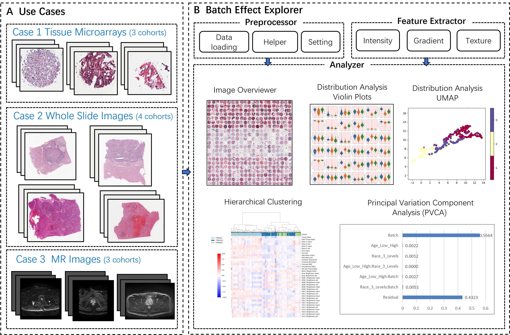

# Batch Effect Explorer for Medical Images



# Installation
Step 1: clone this repo:  

Step 2: change dir to repo folder  

Step 3: automatically create a conda env using cmd below:
```
conda env create -f environment.yaml
```

# Run Example
```
conda activate bee
python bee.py config/example.yaml
```
