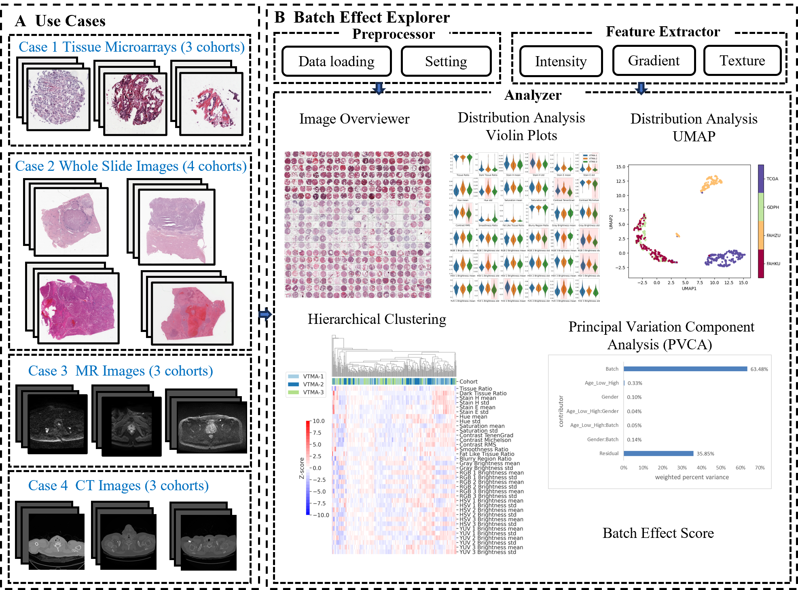
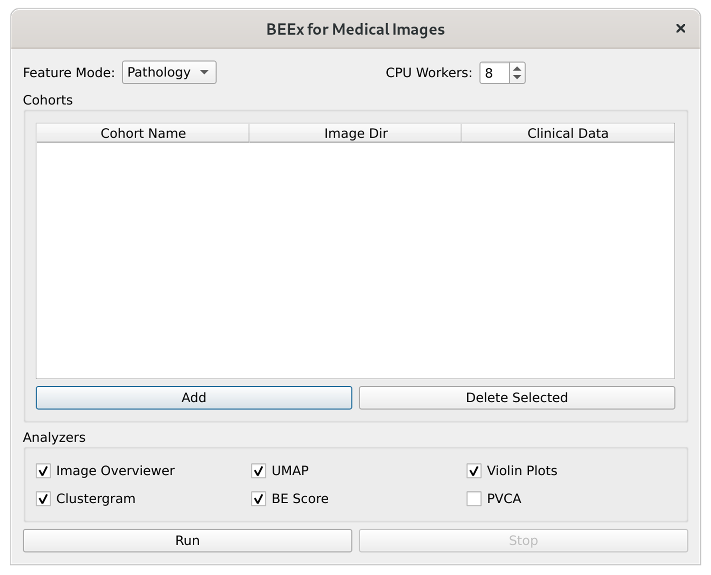

# Batch Effect Explorer (BEEx) for Medical Images
BEEx is a scalable and versatile framework designed to read, process, and analyze a wide range of medical images for batch effect evaluation. It is fully automated, featuring both a graphical user interface (GUI) and a command line interface. Additionally, it includes configuration files that allow for analysis across different cases, and it is freely available to everyone. With the help of BEEx, users can quantify the severity of batch effect among cohorts, trace the possible sources of batch effects, gain insights to address and validate methods used for batch effect rectification.



# Getting started with BEEx
Easily runnable GUI versions of BEEx for Linux and Windows can be found at [Releases](https://github.com/wuusn/beex/releases). Data used for our work can be found at [FigShare](https://figshare.com/s/a58be7e45928df2dfcb2).

To use the BEEx GUI, users need to specify the location of image files of each cohort with a few clicks. After clicking the “Run” button with the selected analyzers, the results will pop up in separate windows. The screenshot of BEEx GUI is shown in below.



# BEEx from command line
For easy of use, BEEx GUI currently is not support WSI filetype and PVCA analyzer. The command line version is fully functional. Here is the usage of BEEx from command line. 

## Installation
Step 1: make sure your system has install [OpenSlide](https://openslide.org/download/)

Step 2: clone this repo

Step 3: change dir to repo folder  

Step 4: automatically create a conda env using cmd below:
```
conda env create -f environment.yaml
```

## OS Requirements
BEEx requires a 64-bit Windows, Linux, or Mac operating system with at least 16 GB of RAM. 

## Run Example
```
conda activate bee
python bee.py config/example.yaml
```

## Configuration
To run BEEx, we need a `yaml` config file. In `config` dir, there are some example yaml files.

Below, we provide a detailed explanation of a config file (config/case_tma.yaml).

```
CaseTMA: # The config title, can be any string
    feature_mode: path # mode of feature extraction, 'path' for pathology and 'radi' for radiology
    n_workers: 8 # number of workers for parallel processing
    cohort_dir: # a list of directories of cohort data
        - '/mnt/hd0/project_large_files/bee/VTMA_v3/SUQH/imgs'
        - '/mnt/hd0/project_large_files/bee/VTMA_v3/QDUH/imgs'
        - '/mnt/hd0/project_large_files/bee/VTMA_v3/SHSU/imgs'
    image_ext: # a list of image file extensions, if not provided, all supported image files in the folder will be used
        - 'png'
    cohort_name: #  a list of cohort names used to identify cohorts, should be the same order as `cohort_dir`
        - 'VTMA-1'
        - 'VTMA-2'
        - 'VTMA-3'
    clinical_data: # a list of clinical data file paths, should be the same order as `cohort_dir`, this is optional
        - '/mnt/hd0/project_large_files/bee/VTMA_v3/SUQH/clinical.xlsx'
        - '/mnt/hd0/project_large_files/bee/VTMA_v3/QDUH/clinical.xlsx'
        - '/mnt/hd0/project_large_files/bee/VTMA_v3/SHSU/clinical.xlsx'
    clinical_column: # a list of clinical data column names, required if provide `clinical_data`
        - 'Invasion'
        - 'Overgrade'
    save_dir: '/data/project_large_files/bee/deploy_test/CaseVTMA' # the folder where we save results
```

